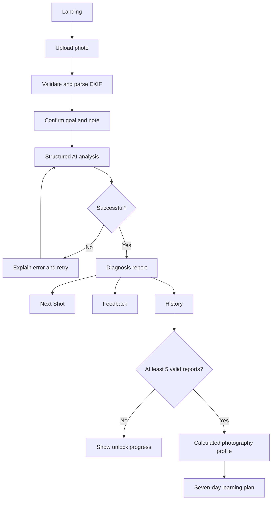

# User Flow

```mermaid
flowchart TD
  A[Landing] --> B[Upload photo]
  B --> C[Validate and parse EXIF]
  C --> D[Confirm goal and note]
  D --> E[Structured AI analysis]
  E --> F{Successful?}
  F -- No --> G[Explain error and retry]
  G --> E
  F -- Yes --> H[Diagnosis report]
  H --> I[Next Shot]
  H --> J[Feedback]
  H --> K[History]
  K --> L{At least 5 valid reports?}
  L -- No --> M[Show unlock progress]
  L -- Yes --> N[Calculated photography profile]
  N --> O[Seven-day learning plan]
```

